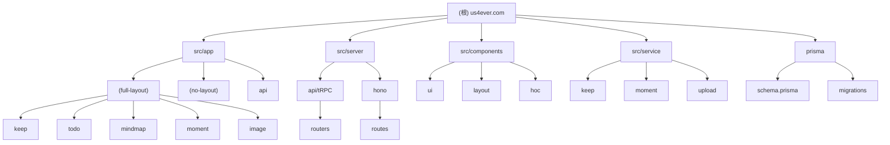

# CLAUDE.md

> **详细技术文档请参阅 [AGENTS.md](./AGENTS.md)** — 包含完整技术栈、架构说明、代码风格指南、环境变量等。

## 项目愿景

**us4ever.com** 是一个现代化的个人工具集合应用，集成笔记管理、思维导图、待办事项、动态分享、图片管理等多个功能模块。采用企业级架构设计，追求极致的开发体验和类型安全。

## 模块结构图



## 模块索引

| 模块路径 | 职责描述 | 入口文件 |
|----------|----------|----------|
| `src/server/api` | tRPC 主 API 路由 | `src/server/api/root.ts` |
| `src/server/hono` | Hono 辅助 API | `src/server/hono/index.ts` |
| `src/app/(full-layout)` | 带完整布局的页面 | `src/app/(full-layout)/layout.tsx` |
| `src/app/(no-layout)` | 无布局的全屏页面 | `src/app/(no-layout)/layout.tsx` |
| `src/components/ui` | 基础 UI 组件库 | `src/components/ui/button.tsx` |
| `src/components/layout` | 布局组件 | `src/components/layout/AppLayout.tsx` |
| `src/service` | 业务逻辑服务层 | `src/service/index.ts` |
| `src/hooks` | 自定义 React Hooks | `src/hooks/use-loading.ts` |
| `src/store` | Zustand 状态管理 | `src/store/user.ts` |
| `prisma` | 数据库模型定义 | `prisma/schema.prisma` |

## 常用命令速查

```bash
pnpm dev                    # 开发 (端口 12345)
pnpm build                  # 生产构建
pnpm db:migrate:dev         # 开发迁移
pnpm db:studio              # Prisma Studio
pnpm lint                   # ESLint 检查
pnpm test                   # Vitest 测试
```

## 关键文件定位

| 需求 | 文件位置 |
|------|----------|
| 添加新 API | `src/server/api/routers/` + `root.ts` |
| 添加新页面 | `src/app/(full-layout)/` 或 `(no-layout)/` |
| 添加新组件 | `src/components/ui/` |
| 添加新服务 | `src/service/` |
| 修改数据库 | `prisma/schema.prisma` |
| 环境变量 | `src/env.js` |

## 变更记录

### 2026-04-07

- 初始化 AI 上下文文档
- 覆盖率: 85%

---

> 本文档由 Claude AI 自动生成并维护。详细技术文档请参阅 [AGENTS.md](./AGENTS.md)。